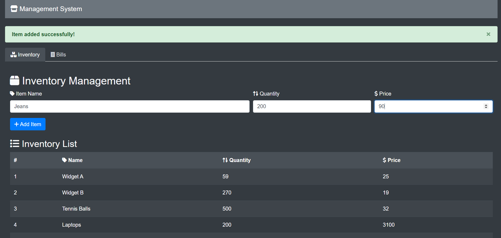

# Inventory and Sales Management System

This project provides a simple inventory and sales management system, allowing users to manage inventory items and create bills.

## Technologies Used

- **Frontend:** HTML, CSS, JavaScript
- **Backend:** Node.js, Express.js
- **Database:** MongoDB, Mongoose

## Features

- **Inventory Management:**
    - View all inventory items
    - Add new items to the inventory
    - (Optional: Implement features like editing and deleting items)
- **Bill Creation:**
    - Create new bills by selecting multiple items from the inventory
    - Calculate the total amount for each bill
    - View a list of all created bills

## Screenshots

**Inventory Management:**

| View Inventory Items | Add Item to Inventory |
|---|---|
|  |  |

**Postman Responses (Inventory):**

| Add New Item | Get All Inventory Items |
|---|---|
|  |  |

**Bill Management:**

| View All Bills | Create a Bill |
|---|---|
|  |  |

**Postman Responses (Bills):**

| Get All Bills | Get Bill by ID | Create Bill |
|---|---|---|
|  |  |  |

## How to Run

1. **Clone the Git repository:**
   `git clone <repository_url>`

2. **Install dependencies (backend):**
   `cd Inventory-Sales-Management`
   `npm install`

3. **Add your MongoDB URI:**
   - Create a `.env` file in the root of your backend project directory.
   - Add the following line to the `.env` file, replacing `<YOUR_MONGO_URI>` with your actual MongoDB connection string:
     `MONGO_URI = <YOUR_MONGO_URI>`

4. **Start the backend server:**
   `npm run start`
   (Make sure you have MongoDB running as well)

5. **Access the frontend (for local usage):**
   - Go to `frontend/index.html`
   - Open with a live server (e.g., using the Live Server extension in VS Code)
   - Access it on `localhost:5500/frontend/index.html` (or the port your live server is running on)

